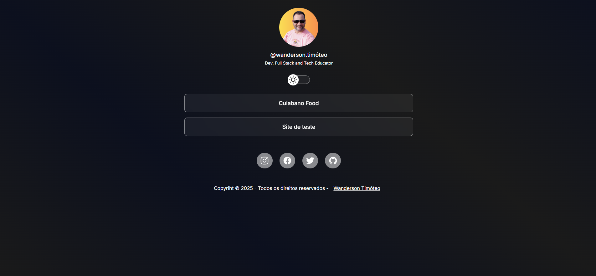

<h1 align="center"> Perfil de Contato </h1>

<br>

<div align="center">
  <a href="#-projeto">👨‍💻 Projeto</a>&nbsp;&nbsp;&nbsp;|&nbsp;&nbsp;&nbsp;
  <a href="#-tecnologias">🚀 Tecnologias</a>&nbsp;&nbsp;&nbsp;|&nbsp;&nbsp;&nbsp;
  <a href="#-funcionalidades">💻 Funcionalidades</a>&nbsp;&nbsp;&nbsp;|&nbsp;&nbsp;&nbsp;
  <a href="#-prévia-do-projeto">📷 Prévia do Projeto</a>&nbsp;&nbsp;&nbsp;|&nbsp;&nbsp;&nbsp;
  <a href="#-executar-aplicação">🔥 Executar Aplicação</a>&nbsp;&nbsp;&nbsp;|&nbsp;&nbsp;&nbsp;
  <a href="#-melhorias-futuras">📌 Melhorias Futuras</a>&nbsp;&nbsp;&nbsp;|&nbsp;&nbsp;&nbsp;
  <a href="#-licença">📄 Licença</a>&nbsp;&nbsp;&nbsp;|&nbsp;&nbsp;&nbsp;
  <a href="#-autor">👨‍💻 Autor</a>&nbsp;&nbsp;&nbsp;|&nbsp;&nbsp;&nbsp;
</div>

<br>

<div align="center">
  
  
  
</div>

<br>

## 👨‍💻 Projeto

Este projeto faz parte do meu processo contínuo de aprendizado e desenvolvimento técnico na área de programação web. Foi desenvolvido com o objetivo de aplicar conceitos práticos de front-end, organização de informações e design responsivo em um cenário real de criação de uma página de perfil pessoal.

O **Perfil de Contato** surgiu da necessidade de reunir em um único espaço digital todos os meus projetos, redes sociais e conteúdos relevantes, oferecendo uma experiência intuitiva e acessível para visitantes e possíveis recrutadores. Além de ser uma ferramenta útil para o compartilhamento do meu portfólio, ele também representa minha evolução técnica e compromisso com a qualidade no desenvolvimento web.

Assim como em metodologias ágeis de desenvolvimento, o projeto foi construído de forma iterativa, priorizando usabilidade, estética e funcionalidade, sendo também uma porta de entrada para minha identidade profissional no mundo da tecnologia.

Para acessar o meu Perfil de Contato **[Clique aqui](https://professor-wanderson-timoteo.github.io/perfil-contato/)**

<br>

## 🚀 Tecnologias

<div align="center">
    
    
    
    
</div>

<br>

- **HTML5** → Estruturação do projeto
- **CSS3** → Estilização e responsividade
- **JavaScript** → Funcionalidades interativas
- **ScrollReveal** → Animações suaves ao rolar a página
- **Google Fonts** → Para fontes
- **Ion Icons** → Para ícones


<br>

## 🧩💻 Funcionalidades

✅ **Design responsivo** para diferentes dispositivos 📱💻  
✅ **Interface moderna e intuitiva** 🎨  
✅ **Código organizado e escalável** 🔧  
✅ **Otimizado para performance e carregamento rápido** 🚀

<br>

## 📷 Prévia do Projeto



<br>

## 🔥 Executar Aplicação

### 🎇 Executando Localmente a Aplicação

Caso você deseja executar o projeto na sua máquina local, você precisará clonar o projeto, para isso, basta seguir os passos abaixo:

### 🌀 Clonar o repositório

Para começar, você deve simplesmente clonar o repositório do projeto na sua máquina.

Navegue até o local onde você clonou o projeto, exemplo:

```sh
C:\Users\NomeDoComputador\Documents\CloneDoProjeto
```

<br>

### 🛰️ Executando o projeto

Para executar sugiro que abra o projeto com o Visual Studio Code (VSCode).
Se estiver usando o VSCode é só instalar a extensão Live Server.
Agora é só executar o arquivo index.html com a extensão Live Server, clique com botão esquerdo do mouse sobre o index.html e selecione a opção **Open with Live Server**.

Pronto! dessa forma o projeto `perfil-contato` estará rodando localmente em sua maquina. Acesse no navegador o endereço abaixo:

```
http://127.0.0.1:5500/index.html
```

<br>

## 🚩 Tenho Dúvidas... O que fazer?

Caso tenha dúvidas sobre o código do projeto, sintam-se a vontade em abrir uma **[ISSUE AQUI](https://github.com/professor-wanderson-timoteo/perfil-contato/issues)**. Assim que possível, responderei todas as dúvidas!

<br>

## 📌 Melhorias Futuras

- Integração com API para gestão dos links de projetos 📊
- Animações adicionais para maior interatividade ✨

<br>

## 📄 Licença

<p>Este projeto é de código aberto e pode ser utilizado para estudos e aprimoramento. 📜</p>

Para mais detalhes sobre a licença: [clique aqui](.github/LICENSE)

<br>

## Autor

<div align="center"> 

<br>

💡 **Desenvolvido por [Wanderson Timóteo](https://github.com/professor-wanderson-timoteo)** </div>
